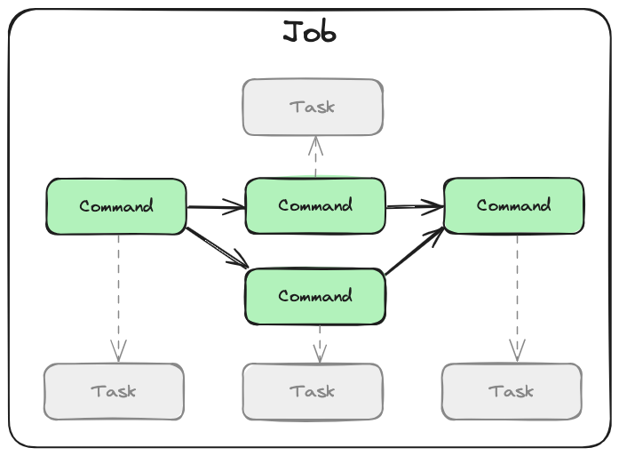

# 🙅‍♂️ETL
_/zɛtəl/_

 

## Overview

xETL is a versatile orchestration library for sequencing the execution of programs. While it *can* be used to build ETL (Extract, Transform, Load) pipelines, its simplicity and flexibility make it suitable for a wide range of tasks.

Its design is inspired by the following set of principles:

1. Minimize complexity by embracing the [Unix Philosophy](https://en.wikipedia.org/wiki/Unix_philosophy).
2. Maximize ease-of-use by reusing concepts from the [POSIX standards](https://en.wikipedia.org/wiki/POSIX) as much as possible.

The result is a simple yet powerful library that is easy to learn.

It is also unopiniated. The library itself is written in Python, but a job can be composed of tasks written in almost any language.

## Concepts

There are only three main concepts to learn in order to build a xETL job.

<!-- > One completes a _job_ by issuing _commands_ for executing _tasks_. -->

### *Job*

The `Job` is the highest level of abstraction in xETL. It outlines a sequence of `Command`s, their execution order, dependencies, and inputs.

It defines a sequence of tasks in the form of a [Directed Acyclic Graph (DAG)](https://en.wikipedia.org/wiki/Directed_acyclic_graph).

### *Command*

The `Command` is a node in the `Job`'s DAG. The term is taken from the [Command Pattern](https://en.wikipedia.org/wiki/Command_pattern) as it contains the necessary parameters for executing a single `Task` at a given time.

### *Task*

The `Task` is a minimal, reusable and composable unit of execution. While `Job`s and `Command`s are purely metadata, a task will actually execute a program.

The `Task` describes how to execute a program as well as its environment variables. It can run most types of executables, such as a bash script, python script, binary application, shell utility, etc. It can even run another nested xETL job which could be helpful to break down more complex jobs.

## Simple Example

We'll look at a simple contrived example to help illustrate how tasks are joined to form a job. Let's say we want our job to do two things:

1. download an image from a web server
2. convert that image to grayscale

