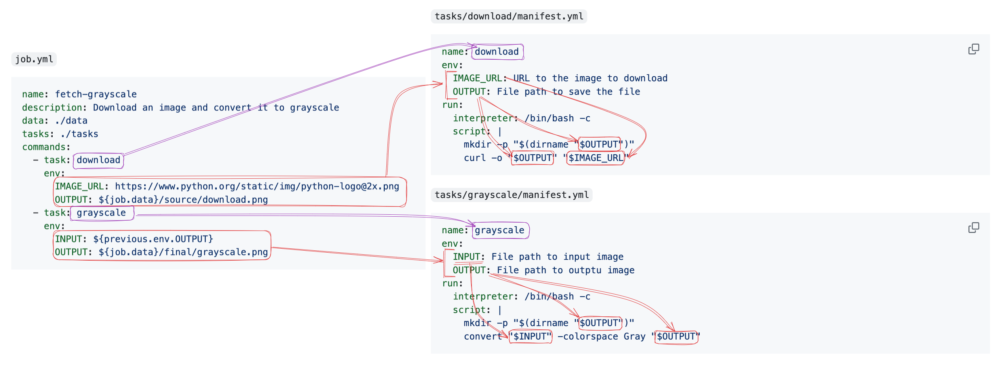
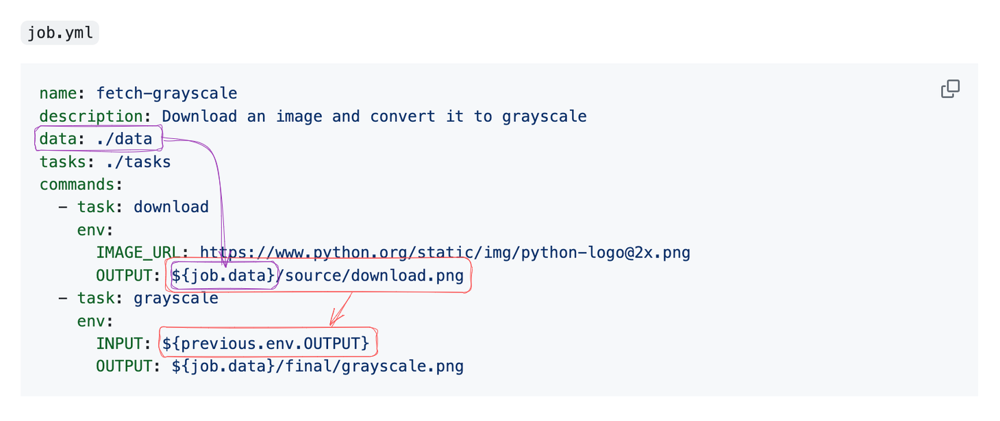

# 🙅‍♂️ETL
_/zɛtəl/_

****[](https://github.com/sebmartin/xETL/actions/workflows/ci.yml?query=branch%3Amain) [](https://codecov.io/gh/sebmartin/xETL)

## Overview

xETL is a versatile orchestration library for sequencing the execution of programs. While it *can* be used to build ETL (Extract, Transform, Load) pipelines, its simplicity and flexibility make it suitable for a wide range of tasks.

Its design is inspired by the following set of principles:

1. Minimize complexity by embracing the [Unix Philosophy](https://en.wikipedia.org/wiki/Unix_philosophy).
2. Maximize ease-of-use by reusing concepts from the [POSIX standards](https://en.wikipedia.org/wiki/POSIX) as much as possible.

The result is a simple yet powerful library that is easy to learn.

It is also unopiniated. The library itself is written in Python, but a job can be composed of tasks written in virtually any language.

## Concepts

There are only three main concepts to learn in order to build a xETL job.

### *Job*

The `Job` is the highest level of abstraction in xETL. It outlines a sequence of `Command`s, their execution order, dependencies, and inputs.

It defines a sequence of tasks in the form of a [Directed Acyclic Graph (DAG)](https://en.wikipedia.org/wiki/Directed_acyclic_graph).

### *Command*

The `Command` is a node in the `Job`'s DAG. The term is taken from the [Command Pattern](https://en.wikipedia.org/wiki/Command_pattern) as it contains the necessary parameters for executing a single `Task` at a given time.

### *Task*

The `Task` is a minimal, reusable and composable unit of execution. While `Job`s and `Command`s are purely metadata, a task will actually execute a program.

The `Task` describes how to execute a program as well as its environment variables. It can run most types of executables, such as a bash script, python script, binary application, shell utility, etc. It can even run another nested xETL job which could be helpful to break down more complex jobs.


## Simple Example

Let's builds a simple job to do two things:

1. download an image from a web server
2. convert that image to grayscale

### The Tasks

We'll start by defining a task for each of these activities.

`tasks/download/manifest.yml`
```yaml
name: download
env:
  IMAGE_URL: URL to the image to download
  OUTPUT: File path to save the file
run:
  interpreter: /bin/bash -c
  script: |
    mkdir -p "$(dirname "$OUTPUT")"
    curl -o "$OUTPUT" "$IMAGE_URL"
```

`tasks/grayscale/manifest.yml`
```yaml
name: grayscale
env:
  INPUT: File path to input image
  OUTPUT: File path to outptu image
run:
  interpreter: /bin/bash -c
  script: |
    mkdir -p "$(dirname "$OUTPUT")"
    convert "$INPUT" -colorspace Gray "$OUTPUT"
```

### The Job

We can now write a job that will make use of these tasks:

`job.yml`
```yaml
name: fetch-grayscale
description: Download an image and convert it to grayscale
data: ./data
tasks: ./tasks
commands:
  - task: download
    env:
      IMAGE_URL: https://www.python.org/static/img/python-logo@2x.png
      OUTPUT: ${job.data}/source/download.png
  - task: grayscale
    env:
      INPUT: ${previous.env.OUTPUT}
      OUTPUT: ${job.data}/final/grayscale.png
```

### Running the Job

That's it! This job can now be executed with:

```shell
$ python -m xetl example/job.yml
```

```
 Loading job manifest at: /Users/user/src/xETL/example/job.yml
╭──╴Executing job: fetch-grayscale ╶╴╴╶ ╶
│ Parsed manifest for job: fetch-grayscale
│ Discovering tasks at paths: ['/Users/user/src/xETL/example/tasks']
│ Loading task at: /Users/user/src/xETL/example/tasks/download/manifest.yml
│ Loading task at: /Users/user/src/xETL/example/tasks/grayscale/manifest.yml
│ Available tasks detected:
│  - download
│  - grayscale
┏━━╸Executing command 1 of 2 ━╴╴╶ ╶
┃   name: null
┃   description: null
┃   task: download
┃   env:
┃     IMAGE_URL: https://www.python.org/static/img/python-logo@2x.png
┃     OUTPUT: /Users/user/src/xETL/example/data/download_source.png
┃   skip: false
┃╭──╴Executing task: download ─╴╴╶ ╶
┃│2024-02-05 22:21:48.633┊ % Total    % Received % Xferd  Average Speed   Time    Time     Time  Current
┃│2024-02-05 22:21:48.633┊ Dload  Upload   Total   Spent    Left  Speed
┃│2024-02-05 22:21:48.633┊
┃│2024-02-05 22:21:48.743┊ 0     0    0     0    0     0      0      0 --:--:-- --:--:-- --:--:--     0
┃│2024-02-05 22:21:48.744┊ 100 15770  100 15770    0     0   139k      0 --:--:-- --:--:-- --:--:--  140k
┃╰──╴Return code: 0 ─╴╴╶ ╶
┃
┏━━╸Executing command 2 of 2 ━╴╴╶ ╶
┃   name: null
┃   description: null
┃   task: grayscale
┃   env:
┃     INPUT: /Users/user/src/xETL/example/data/download_source.png
┃     OUTPUT: /Users/user/src/xETL/example/data/grayscale.png
┃   skip: false
┃╭──╴Executing task: grayscale ─╴╴╶ ╶
┃╰──╴Return code: 0 ─╴╴╶ ╶
│ Done! \o/
```

## How It Works

Admitedly this job is akin to fishing with hand grenades since the same work could be accomplished with a
trivial two-line bash script. It is a contrived example with extremly simple tasks designed to highlight
how xETL jobs work so let's go ahead and dissect it...

### Manifests

xETL jobs, commands and tasks are defined using YAML in "manifest" files. There are two types of manifests
as we saw in the previous example:

1. Task manifest -- describes a task and its parameters
2. Job manifest -- describes a job's paremeters and its commands

A job manifest's path is specified as an argument when running the job, for example:

```shell
$ python -m xetl example/job.yml
```

The job manifest specifies a `tasks` property to provide the base directory where tasks can be found.
This can be a single path or an array of paths:

```
tasks: ./tasks
```
or
```
tasks:
  - ./tasks
  - ~/common-tasks
```

When the job runs, it will traverse these paths looking for `manifest.yml` files and will register each task
using the task's `name` property as its key.

Each command in the job's `commands` array must specify a `task` property which is the `name` of the task
that the command executes.




### The Environment

We mentioned above that the job describes a DAG of tasks and yet we didn't define a DAG anywhere in the
example code. That's because the DAG is defined _implicitly_ by the propagation of **environment variables**.

A task declares its inputs using the `env` dictionary in its manifest. A command invokes a task by providing values
for each one of the task's declared `env` variables. You can see in the example above how the `env` keys in the command
match the `env` keys in the associated task's manifest.

A job's DAG is defined when commands depend on other commands by referencing the `env` values
of a previous command.

For example, in the example above, the first command uses the following values as inputs to the
`download` task:

```yml
    env:
      IMAGE_URL: https://www.python.org/static/img/python-logo@2x.png
      OUTPUT: ${job.data}/source/download.png
```

The `IMAGE_URL` is a static string and is not at all interesting. The `OUTPUT` variable however uses the
*placehold notation* `${job.data}`. This placeholder will be replaced at runtime with the job's `data` property.
This property is set in the job manifest with `data: ./data` and so the `OUTPUT` variable will be set to:

```
./data/source/download.png
```

> [!NOTE]
> Relative paths in the job manifest are expaned relative to the job manifest's base directory. Therefore if
> the job manifest is located at `/Users/user/xETL/example/job.yml` and its data path is set to `./data`,
> then the `${job.data}` placeholder would be replaced with `/Users/user/src/xETL/example/data/`


The second command (`grayscale`) however uses the `previous` placeholder in its value for `INPUT` to
reference the previous command:

```
env:
    INPUT: ${previous.env.OUTPUT}
```


